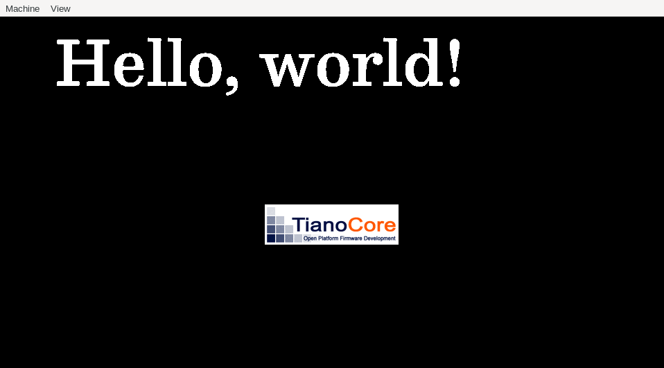

To build:
- `git submodule update --init`
- Go to the definition of `FT_Encoding` in freetype2/include/freetype/freetype.h and comment out the 'for backward compatibility' lines (see https://github.com/ziglang/zig/issues/2115)
- `make`

